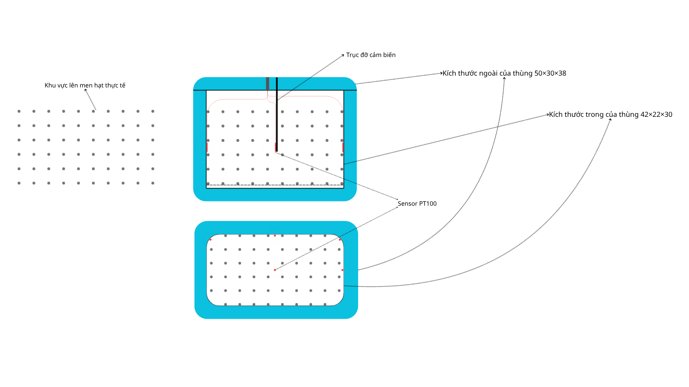

# Yêu cầu công đoạn lên men
## Lên men yếm khí 
- Yêu cầu:
	+ Thoáng đáy để thoát nước quả
	+ Kín khí để tạo môi trường ít Oxi giàu CO2
- Thời gian: Trong vài ngày đầu khi ủ
- Nhiệt độ:	30-35°C

## Lên men hiếu khí
- Yêu cầu:
	+ Thoáng khí để lấy nhiều oxi
	+ Giữ đủ kín để chống côn trùng
- Thời gian: Giai đoạn sau giai đoạn ủ
- Nhiệt độ: 45-50°C

## Quy mô ver.0.1
- Thùng 45 lít
- Kích thước ngoài 50×30×38cm
- Kích thước trong 42×22×30cm

# Thiết kế thùng lên men ver.0.1
