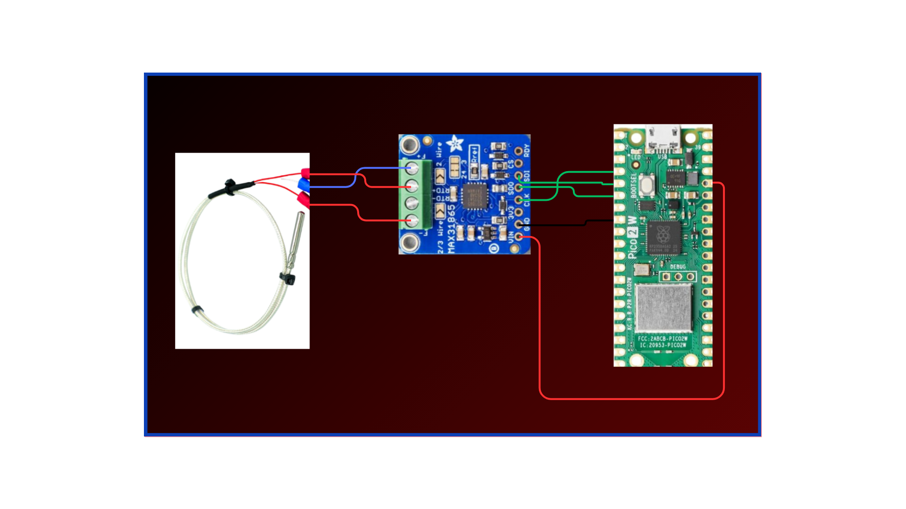

# Tìm giải pháp đảo trộn vị trí các hạt trong thùng lên men

# Nghiên cứu cảm biến nhiệt độ - lên kế hoạch đặt mua board converter nếu cần
## Option 1
- **Cần xác nhận phần cân và thùng lên men là hai phần tách riêng ở 2 công đoạn khác nhau?**
- Dùng ([Raspberry Pi Pico 2 W RP2350](https://raspberrypi.vn/san-pham/mach-raspberry-pi-pico-2w)) để dùng mạch MAX31865 đọc dữ liệu cảm biến PT100
    + Tương thích tốt với cảm biến và mạch MAX31865
    + Giá thành thấp độ bền vẫn áp dụng được trong công nghiệp
- Hình vẽ mô tả kết nối:

## Option 2
- Dùng Jetson Nano đọc cảm biến PT100 thông qua 

# Đưa ra option cho thùng lên men
- Vật liệu gỗ Mít (ưu điểm: phổ biến, bền, chịu được môi trường axit), gỗ Sồi (ưu điểm: bền bỉ, chịu được môi trường axit, thông thoát tốt. nhược điểm: ĐẮT, khó tìm)
- 
